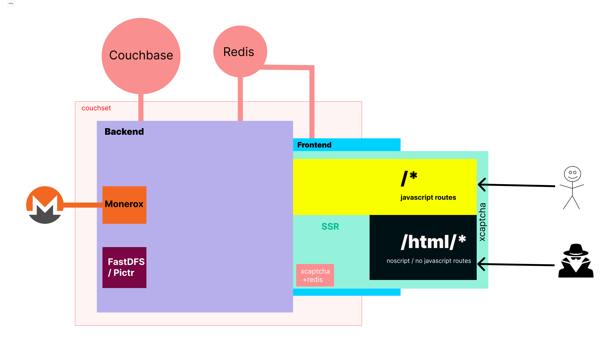

<h1 align="center">
SSLATT (OSS marketplace)
</h1>

<h3 align="center">
Super Slime 🐍 Love All The Time
</h3>

<p align="center">
  <a href="#"></a>
</p>

## Sponsors

<table width="100%">
  <tr height="187px">
    <td align="center" width="33%">
      <a href="mailto:support@stoqey.com">
        Add your logo here
      </a>
    </td>
  </tr>
</table>

## Features

| Name                    | Description |
| ----------------------- | ----------- |
| PGP 2FA                 | ✅          |
| Autowithdraw            | ✅          |
| BTC, XMR                | ✅          |
| Escrow / FE             | ✅          |
| Multisig support        | 🔄          |
| Jabberbot               | 🔄          |
| FE disputes             | 🔄          |
| Auto dispute resolution | 🔄          |
| Walletless pay          | 🔄          |

<p align="center">
  
</p>

### Features frontend

| Name             | Description                                                                           |
| ---------------- | ------------------------------------------------------------------------------------- |
| UI               | Styled-components, twitch-ui like [UUIX](https://github.com/uuixjs/uxweb)             |
| API              | Hooks/Context, Apollo GraphQL via [RoadmanJS Framework](https://github.com/roadmanjs) |
| .....UI features |

### Features backend

| Name     | Description                                                                                                                                               |
| -------- | --------------------------------------------------------------------------------------------------------------------------------------------------------- |
| Database | Couchbase via [Couchset ORM](https://github.com/couchset)                                                                                                 |
| API      | Apollo GraphQL via [RoadmanJS Framework](https://github.com/roadmanjs)                                                                                    |
| Payments | BTC(btcpayserver), XMR(monero rpc) via [RoadmanJS Wallet](https://github.com/roadmanjs/wallet), [RoadmanJS MoneroX](https://github.com/roadmanjs/monerox) |
| Auth     | JWT, 2FA via [RoadmanJS Auth](https://github.com/roadmanjs/auth)                                                                                          |
| Storage  | Local disk / FastDFS via [RoadmanJS](https://github.com/roadmanjs)                                                                                        |

### Requirements

- Node.js 18+ and npm
- Couchbase
- Redis
- BTCPayerServer or monero rpc

## Getting started backend

Run the following command on your local environment:

```shell
git clone --depth=1
yarn
```

Then, you can run the project locally in development mode with live reload by executing:

```shell
yarn dev
```

Open http://localhost:3000 with your favorite browser to see your project.

### Environment

#### Set up authentication

```shell
# 32 chars each
ACCESS_TOKEN_SECRET=random ass string
REFRESH_TOKEN_SECRET=random ass string
```

#### Database and Storage

Set up couchbase and redis

```shell
COUCHBASE_URL=
COUCHBASE_BUCKET=dev
COUCHBASE_USERNAME=admin
COUCHBASE_PASSWORD=

REDIS_URL="rediss://:xxxxxxxx@xxxxxxxx:30296"
```

Default storage is set to local uploads, but you can set fastdfs, pictr e.t.c

#### Set up Payments XMR/BTC

You can accept payments using BTC with btcpayserver or XMR with Monerox

```shell
#BTCPAYSERVER ENV
BTCPAYSERVER_TOKEN=xxxxx
BTCPAYSERVER_STORE=xxxxx
BTCPAYSERVER_URL=https://xxxxxxx.com/api/v1
BTCPAYSERVER_BTC=S-xxxxxx-BTC
BTCPAYSERVER_XMR=S-xxxx-XMR
BTCPAYSERVER_CRON_ENABLED=BTC,XMR
BTCPAYSERVER_CRON=*/1 * * * *

# MONEROX
MONEROX_URL=same as backend url
MONEROX_WALLET=xxxx-xxx-xx-xxx-xxxxxx
MONEROX_CRON=*/1 * * * *

# WALLET RPC
WALLET_RPC_URL=http://xxxxxxxxx:38084
WALLET_RPC_USER=rpc_user
WALLET_RPC_PASSWORD=abc123

# MAIN wallet
WALLET_PATH=abc123
WALLET_PASSWORD=abc123
WALLETS_DIR=/Users/ceddy/xmr/xwallet
```

#### Backend structure

```shell

├── README.md                             # README file
├── .env                                  # Environment configuration
├── .github                               # GitHub folder
├── .vscode                               # VSCode configuration
├── src                                   #
│   └── config                            # Config
│   │   ├── categories.ts                 # Site categories
│   │   ├── site.ts                       # Site settings, admin user, welcome message, e.t.c
│   └── feature                           # Feature e.g. auth, user, wallet
│   │   ├── feature.model.ts              # feature couchbase model / collection / table
│   │   ├── feature.methods.ts            # feature methods
│   │   ├── feature.resolver.ts           # feature graphql api resolver
└── tsconfig.json                         # TypeScript configuration
```

#### Backend customization

Use the `src/config` to set site settings, categories, admin user, welcome message

- `src/config/categories.ts`: categories
- `src/config/site.ts`: site settings configuration file, admin user, welcome message
- `.env`: default environment variables

## Getting started frontend

<!-- UI -->

Run the following command on your local environment:

```shell
git clone --depth=1
yarn
```

Then, you can run the project locally in development mode with live reload by executing:

```shell
yarn dev
```

Open http://localhost:3000 with your favorite browser to see your project.

### Frontend environment

```shell
NEXT_PUBLIC_API_URL="localhost:3037"

ACCESS_TOKEN_SECRET=AadsfasdfASDBSADTFGHLWEFDVKAWMERTXC
REFRESH_TOKEN_SECRET=sadfgsdfvsdfvsdafbsdfbsdf

# ENDGAME rate limit
REQ_PER_MINUTE=25

#
REDIS_URL="redis://localhost"
```

### Frontend structure

```shell
.
├── README.md                         # README file
├── .env                              # Environment configuration
├── .github                           # GitHub folder
├── .husky                            # Husky configuration
├── .storybook                        # Storybook folder
├── .vscode                           # VSCode configuration
├── public                            # Public assets folder
├── src                               #
│   ├── app                           # Next JS App (App Router)
│   │   └── (locale)                  # locale
│   │   │    ├── /                    # JS routes
│   │   │    └── /html                # HTML-only routes (NOSCRIPT)
│   ├── components                    # React components
│   ├── containers                    # React containers
│   │   └── feature                   # feature, e.g auth, wallet, user
│   │   │   ├── feature.tsx           # JS feature with hooks e.t.c
│   │   │   └── feature.html.tsx      # HTML-only feature no javascript / react hooks, just plain HTML
│   ├── middlewares                   # Middlewares
│   │   └── endgame.ts                # Endgame middleware / rate limiter
│   │   └── translation.ts            # translation
│   ├── middleware.ts                 # Root Middleware (combines all)
│   ├── libs                          # 3rd party libraries configuration
│   ├── locales                       # Locales folder (i18n messages)
│   ├── types                         # Type definitions
│   ├── utils                         # Utilities folder
├── tests                             #
│   ├── e2e                           # E2E tests, also includes Monitoring as Code
│   └── integration                   # Integration tests
└── tsconfig.json                     # TypeScript configuration
```

### Frontend customization

Here is some of the most important files to customize:

- `public/apple-touch-icon.png`, `public/favicon.ico`, `public/favicon-16x16.png` and `public/favicon-32x32.png`: your website favicon, you can generate from https://favicon.io/favicon-converter/
- `src/components/logo`: logo and load screen animation
- `.env`: default environment variables

You have access to the whole code source if you need further customization. The provided code is only example for you to start your project. The sky is the limit 🚀.

You also require to run the command each time you want to update the database schema.

### Contributions

Everyone is welcome to contribute to this project. Feel free to open an issue if you have question or found a bug. Totally open to any suggestions and improvements.

### License

Licensed under the MIT License, Copyright © 2024

See [LICENSE](LICENSE) for more information.

## Sponsors

<table width="100%">
    <td align="center" width="33%">
      <a href="mailto:support@stoqey.com">
        Add your logo here
      </a>
    </td>
  </tr>
</table>

---

[](https://github.com/sponsors/stoqey)

<h3 align="center">
Algo Inc
</h3>
